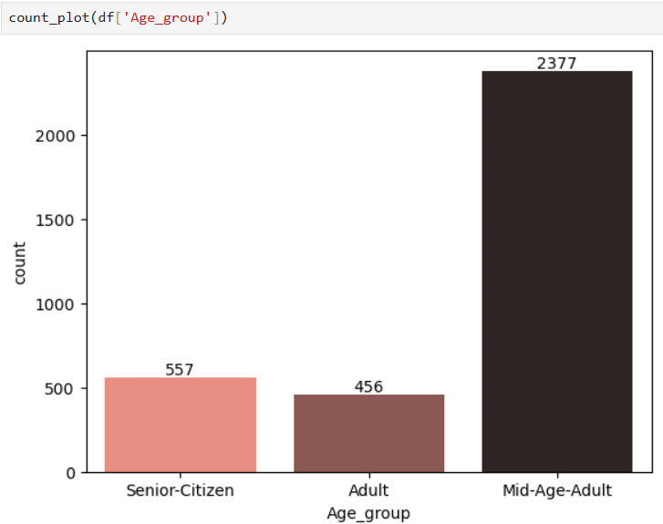
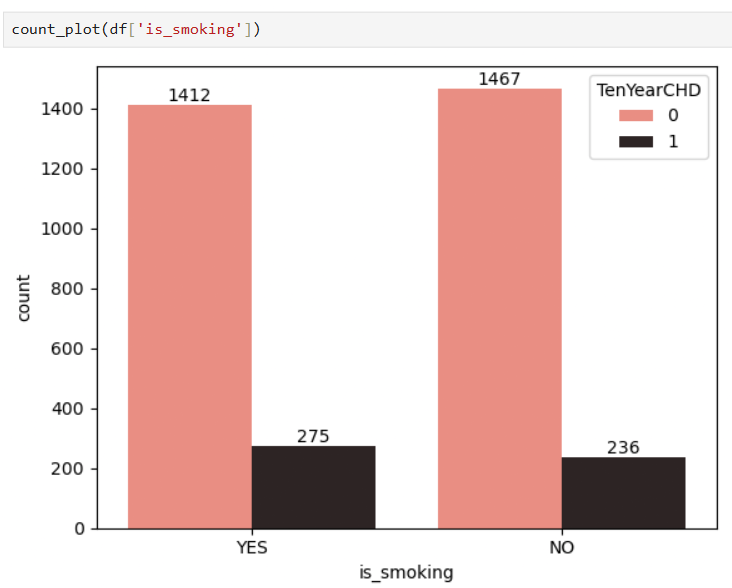
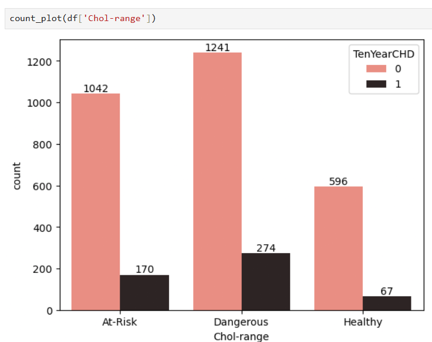
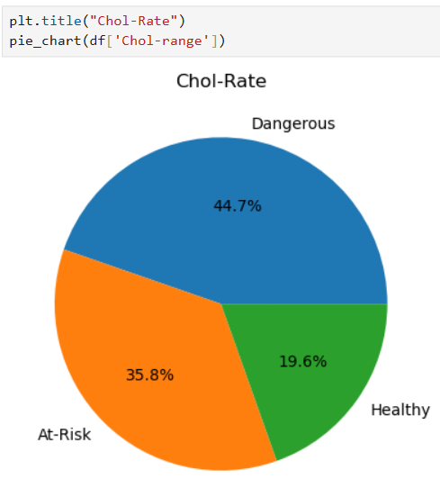

# Heart-Disease-Risk-Analysis
A data-driven approach to predicting Coronary Heart Disease (CHD) risk over a 10-year horizon, based on clinical and lifestyle data.


## Contents
- [Introduction](#introduction)
- [Project Objective](#project-objective)
- [Tools Used](#tools-used)
- [Dataset](#dataset)
- [Importing Libraries & Loading the Dataset](#importing-libraries--loading-the-dataset)
- [Data Understanding](#data-understanding)
- [Data Cleaning](#data-cleaning)
- [Exploratory Analysis](#exploratory-analysis)
- [Risk-Factor Analysis](#risk-factor-analysis)
- [Risk Percentage Breakdown](#risk-percentage-breakdown)
- [Key Findings](#key-findings)
- [Conclusion](#conclusion)
- [Future Improvements](#future-improvements)

## Introduction
Heart disease is one of the leading health concerns worldwide, and catching the warning signs early can make a real difference in preventing serious complications later on.
In this project, I looked at clinical parameters like age, blood pressure, cholesterol, glucose levels, and smoking habits to see how well they predict a person's 10-year risk of developing coronary heart disease (CHD). The idea was to go through a full analysis workflow — cleaning messy real-world data, exploring it, and then digging into which factors actually matter most for heart disease risk.
If you have any feedback or suggestions, feel free to open an issue — always happy to improve this.

## Project Objective
This project aims to analyze clinical and lifestyle factors associated with Coronary Heart Disease (CHD), identify the most influential risk factors through exploratory data analysis, and present meaningful insights that support early risk assessment.

## Tools Used
- **Language:** Python
- **Libraries:** Pandas, NumPy, Matplotlib, Seaborn
- **Environment:** Jupyter Notebook

## Dataset
The dataset used here is a clinical heart-health dataset covering patient records relevant to CHD risk, provided as part of a data analytics training program. After cleaning, it came down to **3,390 records** across **14 attributes** tied to cardiovascular health.
*Note: The raw dataset file is not included in this repository due to licensing restrictions from the source. The full data cleaning and analysis workflow is available in the notebook.*

## Importing Libraries & Loading the Dataset
Started off by importing the libraries needed for this project and loading the dataset into a DataFrame.
```python
import pandas as pd
import numpy as np
import matplotlib.pyplot as plt
import seaborn as sns
import warnings
warnings.filterwarnings("ignore")

df = pd.read_csv("Data_Heart Problem_risk.csv")
df
```
## Data Understanding
Here are the main attributes in the dataset:
| Attribute | Description |
|---|---|
| Age | Patient age |
| Gender | Male/Female |
| sysBP / diaBP | Systolic / Diastolic blood pressure |
| totChol | Total cholesterol |
| glucose | Glucose level |
| BMI | Body Mass Index |
| cigsPerDay | Cigarettes smoked per day |
| Smoking Status | Whether the patient currently smokes |
| Diabetes | Diabetic status |
| BPMeds | On blood pressure medication or not |
| prevalentStroke | History of stroke |
| prevalentHyp | History of hypertension |
| Heart Rate | Resting heart rate |
| **TenYearCHD** | **Target variable** — 10-year CHD risk (0/1) | 

## Data Cleaning
```python
df.info()
df.isna().sum()
df.fillna({'education': int(df['education'].mean()),
          'cigsPerDay': int(df['cigsPerDay'].mean()),
          'BPMeds': int(df['BPMeds'].mean()),
          'totChol': int(df['totChol'].mean()),
          'BMI': int(df['BMI'].mean()),
          'glucose': int(df['glucose'].mean()),
          'heartRate': int(df['heartRate'].mean())}, inplace=True)
df.isnull().sum()
```
After handling missing values, I grouped a few continuous variables into categories to make the analysis easier to interpret later.
```python
# Age groups
df.loc[df["age"]<=19, "Age_group"] = "Teen"
df.loc[(df["age"]>19) & (df["age"]<=39), "Age_group"] = "Adult"
df.loc[(df["age"]>39) & (df["age"]<=59), "Age_group"] = "Mid-Age-Adult"
df.loc[df["age"]>59, "Age_group"] = "Senior-Citizen"

# Blood pressure groups (systolic & diastolic)
df.loc[(df["sysBP"]>130), "sys_BP_group"] = "high"
df.loc[(df["sysBP"]<=130)&(df["sysBP"]>120), "sys_BP_group"] = "Near-high"
df.loc[(df["sysBP"]==120), "sys_BP_group"] = "normal"
df.loc[(df["sysBP"]<120)&(df["sysBP"]>=110), "sys_BP_group"] = "Near-normal"
df.loc[(df["sysBP"]<110), "sys_BP_group"] = "low"

df.loc[(df["diaBP"]>85), "dia_BP_group"] = "high"
df.loc[(df["diaBP"]<=85)&(df["diaBP"]>80), "dia_BP_group"] = "Near-high"
df.loc[(df["diaBP"]==80), "dia_BP_group"] = "normal"
df.loc[(df["diaBP"]<80)&(df["diaBP"]>=75), "dia_BP_group"] = "Near-normal"
df.loc[(df["diaBP"]<75), "dia_BP_group"] = "low"

# Glucose levels
df.loc[(df["glucose"]>=200), "Glucose-level"] = "Danger"
df.loc[(df["glucose"]<=199)&(df["glucose"]>=126), "Glucose-level"] = "Diabetes"
df.loc[(df["glucose"]<=125)&(df["glucose"]>=100), "Glucose-level"] = "Pre-diabetes"
df.loc[(df["glucose"]<=99)&(df["glucose"]>=70), "Glucose-level"] = "normal"
df.loc[(df["glucose"]<70), "Glucose-level"] = "low"

# Cholesterol range
df.loc[(df["totChol"]<200), "Chol-range"] = "Healthy"
df.loc[(df["totChol"]>=200)&(df["totChol"]<=239), "Chol-range"] = "At-Risk"
df.loc[(df["totChol"]>=240), "Chol-range"] = "Dangerous"

# BMI range
df.loc[(df["BMI"]>30), "BMI-range"] = "Obese"
df.loc[(df["BMI"]<=30)&(df["BMI"]>=25), "BMI-range"] = "Over-weight"
df.loc[(df["BMI"]<25), "BMI-range"] = "Normal"
```
## Exploratory Analysis
Before jumping into risk factors, I explored the overall shape of the data — distributions across age groups, smoking habits, and a few other variables — just to get a feel for the dataset.

```python
def count_plot(b):
    sell = sns.countplot(x=b, palette='dark:salmon_r')
    for container in sell.containers:
        sell.bar_label(container)

count_plot(df['sex'])
count_plot(df['is_smoking'])
count_plot(df['Age_group'])
count_plot(df['education'])

sns.histplot(x=df['diaBP'], kde=True)
sns.histplot(x=df['sysBP'], kde=True)

plt.figure(figsize=(8,5))
sns.histplot(df['BMI'], kde=True, color='salmon')
plt.xlabel("Body Mass Index (BMI)")
plt.ylabel("Frequency")
plt.show()

plt.figure(figsize=(8,5))
sns.histplot(df['glucose'], kde=True, color='salmon')
plt.xlabel("Glucose")
plt.ylabel("Frequency")
plt.show()
```


## Risk-Factor Analysis

This is where things got interesting. I looked at how individual factors relate to 10-year CHD risk:

- Smoking status vs. CHD risk
- Gender vs. CHD risk
- Diabetes status vs. CHD risk
- Diastolic and systolic BP levels vs. CHD risk
- Cholesterol levels vs. CHD risk
  
```python
def count_plot(a):
    xyz = sns.countplot(x=a, hue=df['TenYearCHD'], palette="dark:salmon_r")
    for container in xyz.containers:
        xyz.bar_label(container)

count_plot(df['Age_group'])
count_plot(df['sex'])
count_plot(df['Chol-range'])
count_plot(df['Glucose-level'])
count_plot(df['heart_rate_level'])
count_plot(df['sys_BP_group'])
count_plot(df['dia_BP_group'])
count_plot(df['education'])
count_plot(df['BMI-range'])
count_plot(df['diabetes'])
count_plot(df['is_smoking'])
```

 

## Risk Percentage Breakdown
To see the proportion of patients falling into each risk category, I plotted pie charts for the key categorical variables.
```python
def pie_chart(col):
    p = col.value_counts()
    plt.pie(p, labels=p.index, autopct='%.1f%%')
    plt.show()

plt.title("Age Group")
pie_chart(df['Age_group'])

plt.title("Chol-range")
pie_chart(df['Chol-range'])

plt.title("Diastolic BP Rate")
pie_chart(df['dia_BP_group'])

plt.title("Systolic BP Rate")
pie_chart(df['sys_BP_group'])

plt.title("Smoking Status")
pie_chart(df['is_smoking'])

plt.title("Gender Status")
pie_chart(df['sex'])

plt.title("Diabetes Status")
pie_chart(df['diabetes'])
```


## Key Findings
- High systolic and diastolic blood pressure were strongly associated with increased CHD risk.
- Middle-aged patients showed a higher proportion of heart disease cases.
- Elevated cholesterol and glucose levels appeared more frequently among high-risk patients.
- Smoking showed a noticeable relationship with coronary heart disease.
- Multiple overlapping risk factors significantly increased overall CHD risk.

## Conclusion
This analysis shows that blood pressure, cholesterol, glucose levels, and smoking habits play a significant role in long-term CHD risk. These findings highlight the importance of regular health screening and lifestyle modifications for early prevention of cardiovascular disease.

## Future Improvements
- Build Machine Learning models to predict CHD risk.
- Compare multiple classification algorithms.
- Optimize model performance through feature engineering and hyperparameter tuning.
- Evaluate model performance using appropriate classification metrics.
